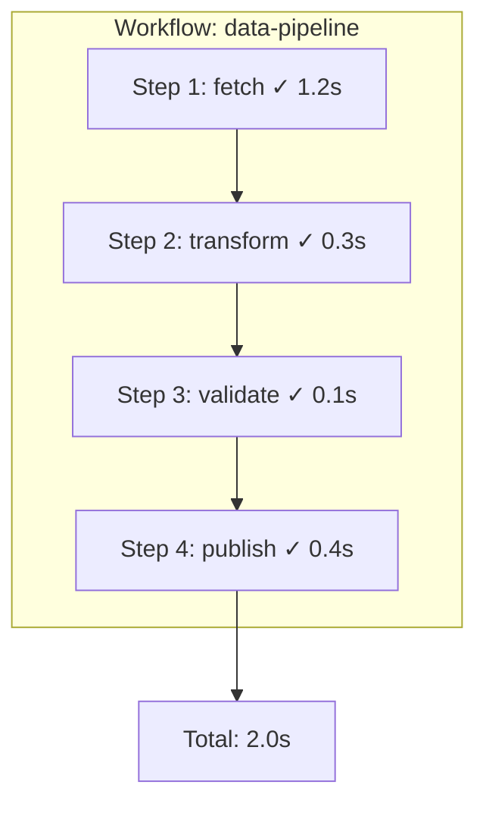
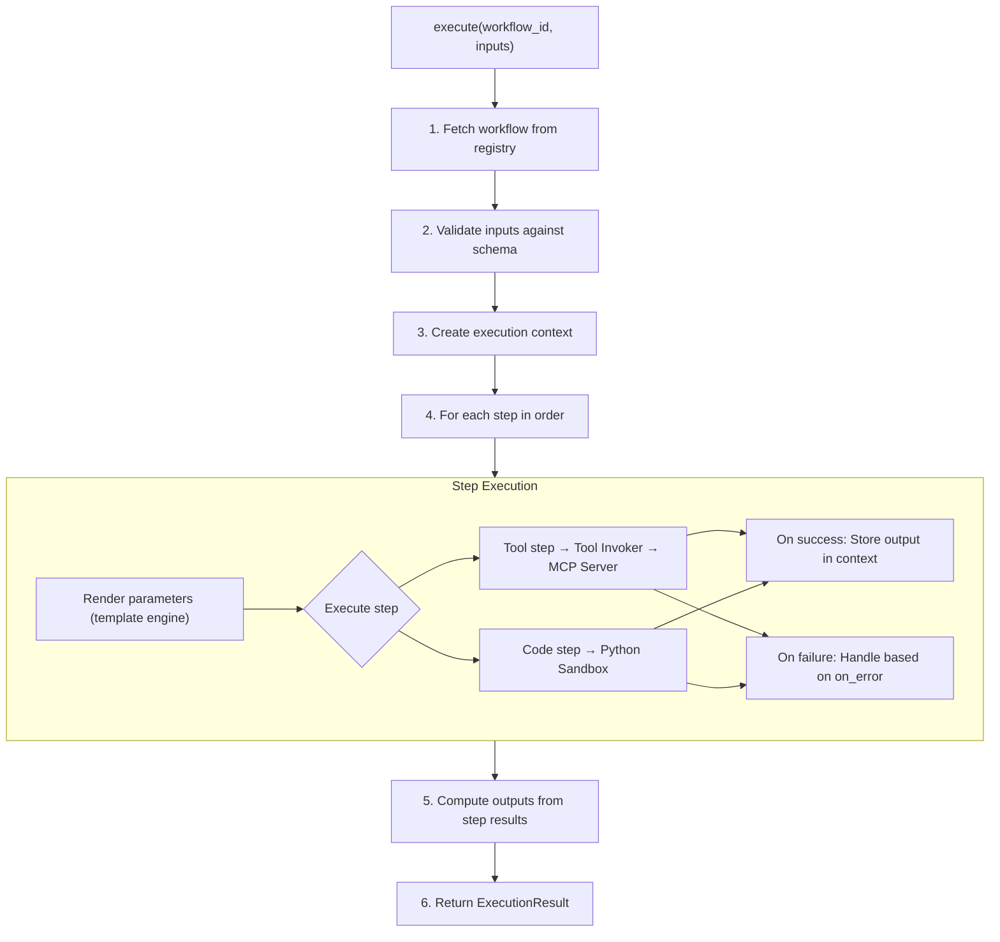

# Execution Model

This page explains how Ploston executes workflows—step by step, deterministically, with full traceability.

---

## Core Principle: Sequential Execution

Ploston executes workflow steps **sequentially**. Each step must complete before the next begins.



This is intentional. Sequential execution is:
- **Predictable** — You know exactly what happens and when
- **Debuggable** — Failures point to a specific step
- **Deterministic** — Same inputs always produce the same execution order

---

## Execution Flow

When you call a workflow, Ploston follows this sequence:



---

## Data Flow Between Steps

Each step can access outputs from previous steps via the `steps` context.

### In Tool Steps (Template Syntax)

```yaml
steps:
  - id: fetch
    tool: http_get
    params:
      url: "{{ inputs.url }}"

  - id: process
    tool: transform_data
    params:
      data: "{{ steps.fetch.output }}"
      format: "{{ steps.fetch.output.content_type }}"
```

### In Code Steps (Python)

```yaml
steps:
  - id: fetch
    tool: http_get
    params:
      url: "{{ inputs.url }}"

  - id: process
    code: |
      # Access previous step output
      data = context.steps['fetch'].output
      
      # Access nested fields
      content = data['body']
      headers = data['headers']
      
      # Return result for next step
      return {"processed": content.upper()}
```

### Context Structure

```python
context.inputs      # Dict[str, Any] - workflow inputs
context.steps       # Dict[str, StepOutput] - completed step outputs
context.config      # Dict[str, Any] - execution configuration
context.execution_id  # str - unique execution identifier
```

Each `StepOutput` contains:
```python
step_output.output      # Any - the step's return value
step_output.success     # bool - whether step succeeded
step_output.duration_ms # int - execution time in milliseconds
step_output.step_id     # str - step identifier
```

---

## Error Handling

Ploston provides three error handling modes, configured per-step or as workflow defaults.

### `on_error: fail` (Default)

Step fails → Workflow stops immediately.

```yaml
steps:
  - id: critical_step
    tool: important_operation
    on_error: fail  # This is the default
```

Result:
- Workflow status: `FAILED`
- Error details in result
- No outputs computed
- Full trace of completed steps

### `on_error: continue`

Step fails → Log warning, continue to next step.

```yaml
steps:
  - id: optional_enrichment
    tool: enrich_data
    on_error: continue  # Failure won't stop workflow
```

Result:
- Step marked as `SKIPPED`
- Workflow continues
- Subsequent steps can check if step was skipped

### `on_error: retry`

Step fails → Retry with configurable backoff.

```yaml
steps:
  - id: flaky_api_call
    tool: external_api
    on_error: retry
    retry:
      max_attempts: 3
      initial_delay: 1.0
      max_delay: 30.0
      backoff_multiplier: 2.0
```

Retry behavior:
1. Attempt 1 fails → wait 1s
2. Attempt 2 fails → wait 2s
3. Attempt 3 fails → treat as `on_error: fail`

Only **retryable errors** trigger retry (network timeouts, rate limits). Non-retryable errors (validation failures, auth errors) fail immediately.

---

## Timeouts

### Per-Step Timeout

```yaml
steps:
  - id: slow_operation
    tool: long_running_task
    timeout: 120  # seconds
```

If the step exceeds its timeout:
- Step is terminated
- Error: `STEP_TIMEOUT`
- Handled according to `on_error` setting

### Workflow Defaults

```yaml
defaults:
  timeout: 30  # Default for all steps
  on_error: fail

steps:
  - id: quick_step
    tool: fast_operation
    # Uses default timeout: 30s

  - id: slow_step
    tool: slow_operation
    timeout: 120  # Override: 120s
```

### Configuration Precedence

```
Step-level config     (highest priority)
      ↓
Workflow defaults
      ↓
System config (ploston-config.yaml)
      ↓
Hardcoded defaults    (lowest priority)
```

Default values:
- `timeout`: 30 seconds
- `on_error`: fail

---

## State and Persistence

### During Execution

State is held **in-memory** during workflow execution:
- Input values
- Step outputs
- Execution context

### After Execution

**No state persists across workflow runs.** Each execution is independent.

This means:
- ✅ No shared state bugs
- ✅ Fully reproducible executions
- ✅ Easy horizontal scaling
- ❌ No resume from checkpoint (yet)

---

## Execution Result

Every execution returns a complete result:

```python
ExecutionResult(
    execution_id="exec-7f3a2b1c",
    workflow_id="data-pipeline",
    workflow_version="1.0",
    status=ExecutionStatus.COMPLETED,
    
    started_at=datetime(...),
    completed_at=datetime(...),
    duration_ms=2000,
    
    inputs={"url": "https://..."},
    outputs={"result": {...}},
    
    steps=[
        StepResult(step_id="fetch", status=COMPLETED, duration_ms=1200),
        StepResult(step_id="transform", status=COMPLETED, duration_ms=300),
        StepResult(step_id="validate", status=COMPLETED, duration_ms=100),
        StepResult(step_id="publish", status=COMPLETED, duration_ms=400),
    ],
    
    steps_completed=4,
    steps_failed=0,
    steps_skipped=0,
)
```

---

## What's NOT Implemented Yet

The following features are planned for future releases:

| Feature | Status | Phase |
|---------|--------|-------|
| **Parallel execution** | Planned | Phase 4 (Enterprise) |
| **Compensation steps** | Planned | Phase 4 (Enterprise) |
| **Human approval gates** | Planned | Phase 4 (Enterprise) |
| **Persistent state** | Planned | Phase 4 (Enterprise) |
| **Async execution** | Planned | Phase 4 (Enterprise) |
| **Execution cancellation** | Planned | Phase 4 (Enterprise) |

**[See Roadmap →](../roadmap.md)**

---

## Next Steps

- **[Security Model](./security-model.md)** — How code steps are sandboxed
- **[Workflows as Tools](./workflows-as-tools.md)** — How workflows become MCP tools
- **[Workflow Schema](../reference/workflow-schema.md)** — Complete YAML reference

**← [How Ploston Works](./how-ploston-works.md)** | **[Security Model →](./security-model.md)**
