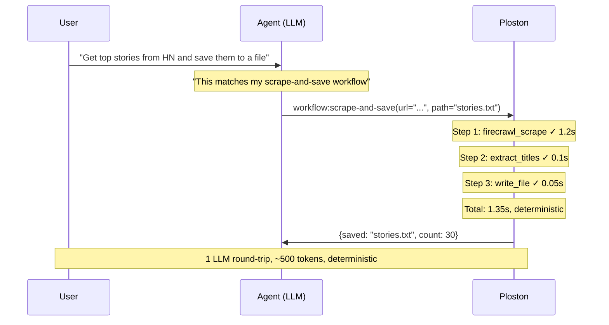
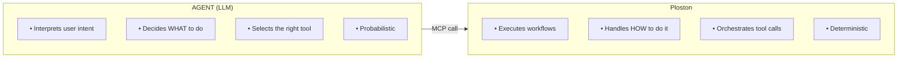

# How Ploston Works

This page explains the core insight behind Ploston: **separating planning from execution**.

If you understand this, everything else makes sense.

---

## The Problem: LLM-Driven Orchestration

When an agent orchestrates its own tool calls, here's what happens:

```
User: "Get top stories from HN and save them to a file"

Agent thinking: "I need to scrape the page first..."
  → Agent calls: firecrawl_scrape(url="https://news.ycombinator.com")
  ← Result: [2,000 tokens of HTML/markdown]
  
Agent thinking: "Now I need to extract the titles..."
  → Agent calls: (inline reasoning to parse the content)
  ← Result: [500 tokens of reasoning]
  
Agent thinking: "Now I need to save to a file..."
  → Agent calls: write_file(path="stories.txt", content=...)
  ← Result: success

Total: 3 LLM round-trips, ~3,000 tokens, non-deterministic
```

### Why This Fails at Scale

**Token cost explodes.** Every step requires the LLM to:
- Receive and process the previous result
- Decide what to do next
- Format the next tool call

A 5-step task might cost 5,000+ tokens. Do this 1,000 times a day and you're burning money.

**Non-determinism creeps in.** The LLM might:
- Decide to take a different path
- Hallucinate an extra step
- Format parameters slightly differently
- Forget context from earlier steps

Same input, different output. Good luck testing that.

**No audit trail.** When something fails, you get a blob of reasoning. Which step failed? What were the intermediate values? You're debugging in the dark.

**Retry logic is unreliable.** If step 3 fails, does the agent retry? Retry the whole chain? Give up? It depends on the LLM's mood.

---

## The Solution: Deterministic Execution

AEL inverts the model. The agent makes **one decision** (which workflow to call), and Ploston handles the **execution**.



### What Changes

| Dimension | LLM Orchestrates | Ploston Orchestrates |
|-----------|------------------|------------------|
| **LLM calls** | N (one per step) | 1 (workflow invocation) |
| **Token cost** | High, variable | Low, predictable |
| **Determinism** | No | Yes |
| **Audit trail** | None | Full step-by-step trace |
| **Retry logic** | LLM decides (unreliable) | Configured per-step |
| **Testability** | Difficult | Unit testable |

---

## The Separation Principle

This is the core architectural insight:



The agent remains the **decision-maker**. It interprets what the user wants and picks the appropriate workflow.

Ploston is the **execution substrate**. It runs the workflow deterministically, handles errors, logs everything, and returns a clean result.

This is analogous to how infrastructure has evolved:

| Domain | Before | After |
|--------|--------|-------|
| Infrastructure | Manual provisioning | Terraform |
| Operations | Imperative scripts | Kubernetes |
| Workflows | Ad-hoc code | Temporal |
| **Agent execution** | **LLM orchestration** | **Ploston** |

---

## Workflows as Virtual Tools

When you define a workflow in Ploston, it becomes an MCP tool that agents can call.

```yaml
# workflows/scrape-and-save.yaml
name: scrape-and-save
version: "1.0"
description: "Scrape a URL and save extracted content to a file"

inputs:
  - url:
      type: string
      description: "URL to scrape"
  - path:
      type: string
      description: "File path to save results"

steps:
  - id: fetch
    tool: firecrawl_scrape
    params:
      url: "{{ inputs.url }}"
      
  - id: extract
    code: |
      import re
      content = context.steps['fetch'].output['markdown']
      titles = re.findall(r'^##\s*(.+)$', content, re.MULTILINE)
      return {"titles": titles}
      
  - id: save
    tool: write_file
    params:
      path: "{{ inputs.path }}"
      content: "{{ steps.extract.output.titles | join('\n') }}"

outputs:
  - saved_path:
      from_path: steps.save.output.path
  - count:
      value: "{{ steps.extract.output.titles | length }}"
```

When Ploston starts, this workflow appears as a tool:

```
Tools available:
  - workflow:scrape-and-save
  - firecrawl_scrape
  - write_file
  - ...
```

The agent sees `workflow:scrape-and-save` as just another tool. It doesn't know or care that it's a multi-step workflow. It calls it like any other tool, and Ploston handles the execution.

---

## What This Enables

### Predictable Cost

You know exactly what a workflow costs because it always executes the same steps. No LLM reasoning loops. No token explosion.

### Testability

Workflows are code. You can unit test them:

```bash
ploston test workflows/scrape-and-save.yaml --input url=https://example.com --input path=test.txt
```

Same inputs → same outputs → passing tests.

### Debuggability

Every execution produces a trace:

```
Execution: exec-7f3a2b1c
Workflow: scrape-and-save
Duration: 1.35s
Status: SUCCESS

Steps:
  [1] fetch         ✓  1.20s  tool=firecrawl_scrape
  [2] extract       ✓  0.10s  code (18 lines)
  [3] save          ✓  0.05s  tool=write_file

Inputs: {url: "https://...", path: "stories.txt"}
Output: {saved_path: "stories.txt", count: 30}
```

When something fails, you know exactly which step, with full input/output visibility.

### Governance (Enterprise)

Because execution flows through Ploston, you can enforce:
- Who can run which workflows
- What inputs are allowed
- What outputs are permitted
- Audit logs for compliance

The agent doesn't bypass governance—it calls Ploston, and Ploston enforces policy.

---

## Next Steps

- **[Execution Model](./execution-model.md)** — Detailed execution semantics
- **[Workflows as Tools](./workflows-as-tools.md)** — MCP integration
- **[Why Ploston?](../why-ploston.md)** — Comparison with alternatives

**← [Back to Home](../index.md)**

