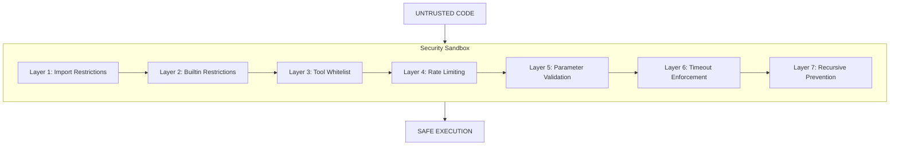

# Security Model

Ploston executes arbitrary Python code from workflows. This requires defense in depth.

This page explains Ploston's 7-layer security model—what each layer does and why it exists.

---

## Overview

When a workflow contains a `code:` step, Ploston executes Python in a sandboxed environment. The sandbox enforces multiple security layers to prevent:

- **System access** — No file system, network, or process operations
- **Code injection** — No eval, exec, or dynamic imports
- **Resource exhaustion** — Timeouts and rate limits
- **Privilege escalation** — Strict tool access controls



---

## The 7 Layers

### Layer 1: Import Restrictions (AST-based)

**What it does:** Only whitelisted modules can be imported. All imports are validated at parse time using AST analysis—before any code executes.

**Why it exists:** Prevents access to dangerous system modules.

**Blocked modules include:**
- `os`, `sys` — System access
- `subprocess`, `shutil` — Process execution
- `socket`, `http`, `urllib` — Network access
- `ctypes`, `cffi` — Native code execution
- `pickle`, `marshal` — Arbitrary object deserialization

**Allowed modules:** See [What's Allowed](#whats-allowed) below.

---

### Layer 2: Builtin Restrictions

**What it does:** Dangerous Python builtins are removed from the execution environment.

**Why it exists:** Prevents arbitrary code execution and system access.

**Removed builtins:**
```python
DISALLOWED_BUILTINS = [
    "eval",       # Arbitrary code execution
    "exec",       # Arbitrary code execution
    "compile",    # Code compilation
    "open",       # File system access
    "input",      # Interactive input
    "__import__", # Dynamic imports
    "globals",    # Namespace access
    "locals",     # Namespace access
    "getattr",    # Attribute access bypass
    "setattr",    # Attribute modification
    "delattr",    # Attribute deletion
    "breakpoint", # Debugger access
]
```

---

### Layer 3: Tool Whitelist

**What it does:** Code can only call tools that are explicitly available to the workflow. Tools are accessed through `context.tools.call()`, not by direct import.

**Why it exists:** Principle of least privilege. Code cannot enumerate or access tools beyond what the workflow needs.

```python
# ✅ Allowed: Call a tool available to this workflow
result = await context.tools.call("http_get", {"url": "https://api.example.com"})

# ❌ Blocked: Cannot enumerate available tools
# ❌ Blocked: Cannot call tools not in workflow's scope
```

---

### Layer 4: Rate Limiting

**What it does:** Limits the number of tool calls per code execution.

**Why it exists:** Prevents infinite loops and resource exhaustion.

**Default limit:** 10 tool calls per execution

```python
# After 10 calls, this will raise RESOURCE_EXHAUSTED
for i in range(100):
    await context.tools.call("some_tool", {...})  # Fails at call 11
```

---

### Layer 5: Parameter Validation

**What it does:** All tool parameters must be JSON-serializable. Type checking is enforced.

**Why it exists:** Prevents injection attacks and ensures clean data boundaries.

```python
# ✅ Valid: JSON-serializable parameters
await context.tools.call("api", {"data": {"key": "value"}})

# ❌ Invalid: Non-serializable objects
await context.tools.call("api", {"data": some_object})
```

---

### Layer 6: Timeout Enforcement

**What it does:** Code execution is terminated if it exceeds the configured timeout.

**Why it exists:** Prevents hanging and resource exhaustion.

**Default timeout:** 30 seconds

```yaml
steps:
  - id: process
    code: |
      # This will be killed after 30 seconds
      while True:
        pass
    timeout: 30
```

---

### Layer 7: Recursive Prevention

**What it does:** Code steps cannot invoke other code steps (no `python_exec` calling `python_exec`).

**Why it exists:** Prevents recursive execution attacks and stack exhaustion.

```python
# ❌ Blocked: Cannot call python_exec from within code
await context.tools.call("python_exec", {"code": "..."})  # TOOL_REJECTED
```

---

## What's Allowed

The following modules are whitelisted by default:

### Standard Library (Safe)
```python
STANDARD_IMPORTS = [
    "json",        # JSON parsing
    "re",          # Regular expressions
    "datetime",    # Date/time handling
    "math",        # Mathematical functions
    "random",      # Random number generation
    "typing",      # Type hints
    "collections", # Data structures
    "itertools",   # Iteration utilities
    "functools",   # Function utilities
    "hashlib",     # Hashing (no crypto)
    "uuid",        # UUID generation
    "base64",      # Base64 encoding
    "urllib.parse",# URL parsing only
]
```

### Common Libraries (Optional)
```python
COMMON_IMPORTS = [
    "requests",    # HTTP client (if installed)
    "pydantic",    # Data validation (if installed)
    "jmespath",    # JSON querying (if installed)
    "dateutil",    # Date parsing (if installed)
    "yaml",        # YAML parsing (if installed)
]
```

---

## Configuration

Sandbox behavior can be configured per-workflow or globally:

```yaml
# In workflow definition
defaults:
  sandbox:
    timeout: 60
    max_tool_calls: 20
    allowed_imports:
      - json
      - re
      - datetime
      - custom_module  # Add custom modules
```

---

## Enterprise Security (Coming)

The following security features are planned for Enterprise:

| Feature | Description | Phase |
|---------|-------------|-------|
| **RBAC/ABAC** | Role and attribute-based access control | Phase 4 |
| **Policy Engine** | Cedar/Rego-based policy enforcement | Phase 4 |
| **Audit Logging** | Complete execution audit trail | Phase 4 |
| **SSO Integration** | Enterprise identity providers | Phase 4 |
| **Multi-Tenancy** | Isolated execution environments | Phase 4 |

**[See Roadmap →](../roadmap.md)**

---

## Security Best Practices

1. **Minimize code steps** — Use tool steps when possible; they're inherently safer
2. **Validate inputs** — Don't trust workflow inputs; validate in code
3. **Limit tool scope** — Only include tools the workflow actually needs
4. **Set timeouts** — Always configure appropriate timeouts
5. **Review workflows** — Treat workflow YAML like code; review before deployment

---

## Reporting Security Issues

If you discover a security vulnerability in Ploston, please report it responsibly:

1. **Do not** open a public GitHub issue
2. Email security concerns to **security@ostanlabs.com**
3. Include steps to reproduce
4. Allow time for a fix before public disclosure

---

## Next Steps

- **[Execution Model](./execution-model.md)** — How workflows execute
- **[Workflows as Tools](./workflows-as-tools.md)** — MCP integration
- **[Workflow Schema](../reference/workflow-schema.md)** — Complete YAML reference

**← [Execution Model](./execution-model.md)** | **[Workflows as Tools →](./workflows-as-tools.md)**
